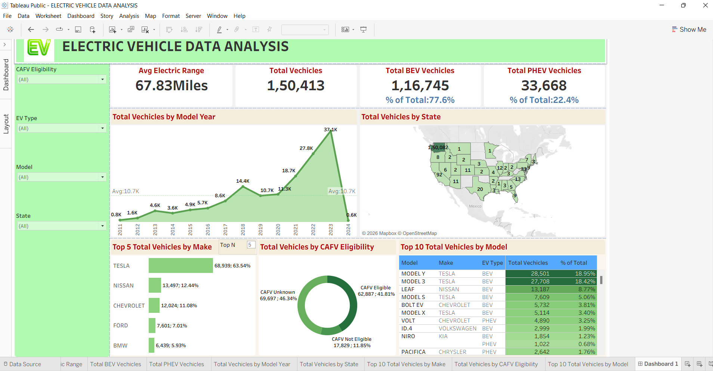

# ⚡ Electric Vehicle Data Analysis Dashboard (Tableau)

An interactive Tableau dashboard analyzing Electric Vehicle trends, adoption patterns, and performance insights to support data-driven decision-making.

---

## 🎯 Problem Statement
The goal of this project is to analyze electric vehicle data to identify trends, adoption rates, and key performance indicators that can help stakeholders make informed decisions.

---

## 🔗 Live Dashboard
👉 https://public.tableau.com/views/ELECTRICVEHICLEDATAANALYSIS_17744868983890/Dashboard1

---

## 📊 Dashboard Preview

---

## 📌 Key Insights
- Significant growth in EV adoption over recent years  
- Certain regions show higher EV penetration  
- Battery Electric Vehicles dominate over Hybrid models  
- Key manufacturers contribute majority of market share  

---

## 🛠 Tools Used
- Tableau Public  
- Microsoft Excel  
- Data Cleaning Techniques  

---

## 🎯 Skills Demonstrated
- Data Cleaning  
- Data Visualization  
- Dashboard Design  
- Business Analysis  
- Business Intelligence  

---

## 📂 Dataset
The dataset used in this project exceeds GitHub size limits and is not uploaded here.  
The full analysis can be explored through the Tableau dashboard link above.

---

## 👤 Author
**Shubh Srivastava**

---
